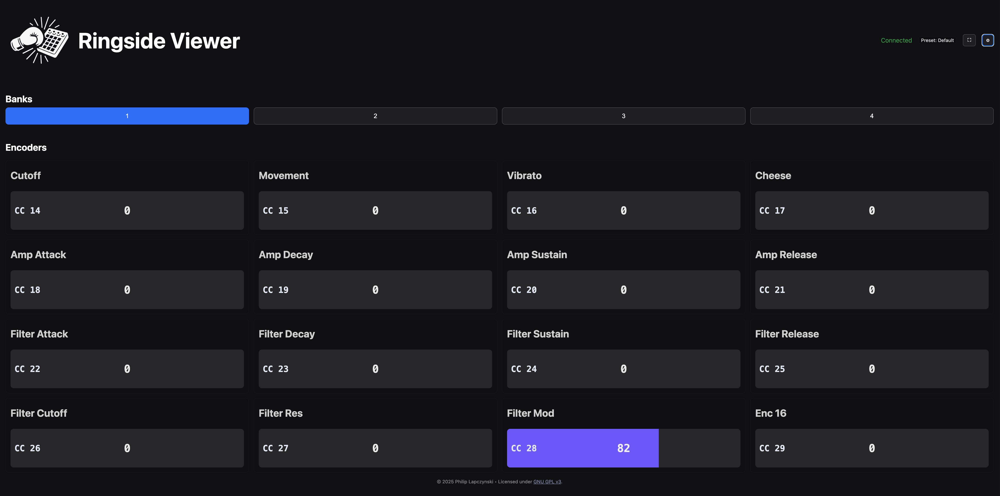

Ringside Viewer
===============

Ringside Viewer is a performance-oriented, browser-based controller display and preset manager designed for the Midi Fighter Twister. It provides clear live-mode visuals, robust preset management, and reliable bank switching over LAN with optional Web MIDI echo.

Key features
- Presets: Load/Save/Save As/Download, dirty tracking, sorted lists, active preset header, and clearing of undefined labels on load.
- Live mode: Large fullscreen title, configurable banks position (above/below), responsive layout, improved contrast, and bank-select echo to hardware.
- Display settings: Toggles for showing MIDI CC and Value overlays, theme controls (System/Light/Dark), and persistent preferences.
- MIDI and networking: Host-side bank-select message on remote switches; optional Web MIDI echo when available.

Development
- Backend: FastAPI app under `src/fighterdisplay/ui/backend`.
- Frontend: Static assets under `src/fighterdisplay/ui/frontend`.
- Presets: JSON files under `assets/presets/` (or `CONFIG_DIR`/`CONFIG_PATH`).

License
- This project is licensed under the GNU General Public License v3.0 (GPL-3.0).
- See the full text in the `LICENSE` file or at: https://www.gnu.org/licenses/gpl-3.0.html

Getting Started
---------------

Requirements
- macOS, Linux, or Windows
- Python 3.11+
- Optional: a connected MIDI Fighter Twister (for hardware feedback)
- Optional: a Web MIDI–capable browser (Chrome/Edge) if you want browser → device echo

Install
- make setup – creates `.venv` and installs dependencies from `requirements.txt`.
- Optional hardware extras: `make setup-hw` installs `python-rtmidi` to enable backend MIDI I/O.

Run the app
- make dev – starts FastAPI on http://localhost:8000 and serves the static UI.
- make list-ports – prints available backend MIDI input/output ports.

Open the UI
- Visit http://localhost:8000 in your browser.
- Header toolbar shows connection status, active preset, fullscreen, and settings.
- Click the fullscreen button to enter a performer view with larger banks/encoders and a preset title.

Using Presets
- Presets live in `assets/presets/` by default. You can override with env vars:
  - CONFIG_DIR – directory of presets (when selecting by name).
  - CONFIG_PATH – full path to the active preset file.
- Load – chooses a preset from the drop‑down and applies it to the app.
- Save – saves changes to the current preset file.
- Save As – prompts for a new preset name and saves to `assets/presets/` (or CONFIG_DIR).
- Download – downloads the current preset JSON.

Assigning Controls (CC + Channel)
- Click an encoder cell to open the Assign MIDI CC modal.
  - CC – set the MIDI CC number (0–127).
  - Channel – set the MIDI channel (1–16). Defaults to 1.
  - Label – friendly name shown in the grid.
- MIDI Learn – toggle in the MIDI panel, then click a cell and move a hardware control.
  - The app captures CC and the channel (as 1–16) and stages the change.
- Changes are staged in memory until you Save/Save As the preset.

Banks & Live Mode
- Use the 1–4 bank buttons (or keyboard keys 1–4) to switch banks.
- Settings → Display Settings lets you place banks above or below the encoders.
- Fullscreen adds a big preset title; the app keeps the logo top‑right and avoids overlap automatically.

MIDI I/O
- Backend MIDI (optional; requires `make setup-hw`):
  - The server can discover ports and echo bank‑select messages to an attached device.
  - Use `make list-ports` to view available inputs/outputs.
- Web MIDI (optional):
  - In supported browsers, you can select Web MIDI In/Out from the MIDI panel.
  - With Echo enabled, incoming CCs are echoed back to the device to drive LED rings.
  - Note: LED echo currently uses the incoming message’s channel; per‑encoder channel is stored for presets and mapping.

Environment Variables
- CONFIG_DIR – directory containing preset JSON files. Default: `assets/presets`.
- CONFIG_PATH – full path to a specific preset JSON. Overrides CONFIG_DIR/current.
- LED_ECHO – `1` (default) or `0` to disable backend LED echo.
- HEARTBEAT_HZ – server heartbeat frequency (default 10.0).

Testing
- make test – runs pytest with quiet output and coverage.
- Tests avoid requiring real MIDI hardware; backend MIDI is mocked where appropriate.

Troubleshooting
- Browser says Web MIDI unsupported – use Chrome/Edge, or rely on backend MIDI only.
- No MIDI ports listed – run `make list-ports`, install hardware extras via `make setup-hw`, and check device permissions.
- Preset changes not saving – use Save/Save As in the Presets panel (staged edits via MIDI Learn or the CC modal are in-memory until saved).
